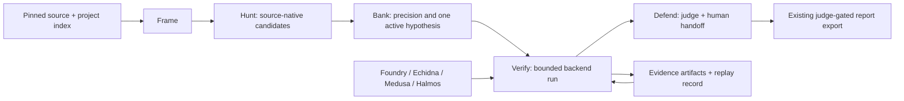

# ZeroPath Harness Architecture

ZeroPath's stable workflow is an evidence-first control plane around replaceable
smart-contract execution engines. The harness is intentionally not a generic
shell wrapper and it does not turn a fuzzer's green exit code into a security
claim.

## Design goals

The design combines the durable Hunt loop with the strongest recurring ideas in
Foundry invariant testing, Echidna, Medusa, Halmos, and stateful property-based
testing:

- freeze target identity before discovery;
- model a protocol as stateful operations and invariants, not isolated regex hits;
- keep one expensive verification item active by default;
- make seeds, source digests, commands, timeouts, and outputs replayable;
- persist a corpus/failure sequence independently of the backend that found it;
- shrink a failing sequence only through a deterministic predicate;
- separate generated routing artifacts from executable reality anchors;
- fail closed on scope drift, path escape, missing backends, and incomplete evidence;
- require human review before a report can be exported.

## Control plane and data plane

The existing `core` package remains the domain layer: project configuration,
indexed source, candidates, evidence, judge checks, and report gating. The new
`zeropath.harness` package is the control plane that drives those domain
objects through a bounded campaign. Backends are data-plane adapters and are
never allowed to change the campaign boundary.



## Durable state

Each campaign lives under:

```text
.zeropath/harness/campaigns/<campaign-id>/
  run.json              # manifest, phase, checkpoint, source identity
  scope.md              # local-only boundary and best-effort assumptions
  frame-facts.md        # adapter and operation map
  baseline.json         # toolchain and initial worktree observations
  reference-lock.json   # hashed frame artifacts and frozen rules
  coverage.json         # operation outcomes; never a safety certificate
  attack-surface.json   # provenance-preserving candidate queue
  metrics.json          # paired workflow metrics, not verdicts
  events.jsonl          # append-only phase and backend event log
  runs/<run-id>.json    # bounded backend observations
  evidence/             # generated PoCs, judge results, and supporting traces
  corpus/               # portable stateful replay cases
  handoff.md            # exact next action and unresolved proof
```

`run.json` is a materialized recovery snapshot. `events.jsonl` is append-only,
so a crash leaves the last committed observation available for inspection. JSON
snapshots are written through a temporary file and atomic replace. Campaign
state is never mixed across projects or source digests. Framing also persists a
seeded, backend-neutral corpus under `corpus/cases/`; those cases are replay
inputs and accounting artifacts, not proof until an adapter executes them.

## State machine

The controller exposes explicit transitions:

```text
frame -> hunt -> bank -> verify -> defend -> complete
  ^       ^       ^       ^        ^
  |       |       |       |        |
  +-------+-------+-------+--------+-- paused (resume only the named proof)
```

The phase is not inferred from chat history. A checkpoint is written before a
material action and after its result. A source-digest change pauses the
campaign; it cannot silently refresh the lock or reuse old evidence.

## Backend ports

`BackendContext` contains only the campaign id, target root, scoped target path,
seed, timeout, and optional replay id. The backend registry owns the executable
name and command shape:

- Foundry runs offline and can be narrowed with `--match-path`.
- Echidna requires a scoped Solidity harness path.
- Medusa runs from the target Foundry project configuration.
- Halmos runs from the target Foundry project configuration.

There is no `shell=True`, arbitrary command string, public RPC option, or
credential path in this interface. Output is bounded before it becomes durable
evidence. Missing binaries are recorded as `unavailable`, not as a passing or
failing security result.

## Stateful corpus

`CorpusCase` stores abstract operations, callers, arguments, seed, depth, and a
failure fingerprint. Framing persists deterministic cases for the indexed
operations. `generate_cases()` is deterministic for a seed. An adapter provides
the execution predicate to `shrink_case()`, which tries action deletion and
integer reductions while preserving the same failure. This keeps shrinking
portable and prevents an engine-specific trace format from becoming the source
of truth.

## Evidence contract

The harness records backend observations and routes them into the existing
candidate evidence model. It does not mark a candidate report-ready merely
because a backend exits successfully. The judge still requires an attacker
model, reachable state, source locations, a concrete path, proof output, known
issue/duplicate checks, and measured impact. The final status is
`SUBMIT-READY-PENDING-HUMAN` only when the human-facing gate passes.

## Deliberate limits

The current stable harness is EVM-first. Solidity parsing remains heuristic,
generic ABI/state-machine synthesis is not claimed, and no public-chain or
real-fund execution is supported. Concrete proof generators (currently the
ERC4626 inflation and initializer-takeover verticals) are the correct place to
add domain-specific setup and assertions. A new generator should supply a
source detector, executable test renderer, measured-event interpreter, clean
baseline, and negative control before being promoted.

Useful commands:

```bash
zeropath harness init --repo . --seed 1
zeropath harness run --phase hunt
zeropath harness run --phase bank --candidate ZP-001
zeropath harness run --phase verify --candidate ZP-001 --write-test-dir
zeropath harness run --phase defend --candidate ZP-001
zeropath harness status --json
zeropath harness replay --campaign H-... --run BR-...
```
